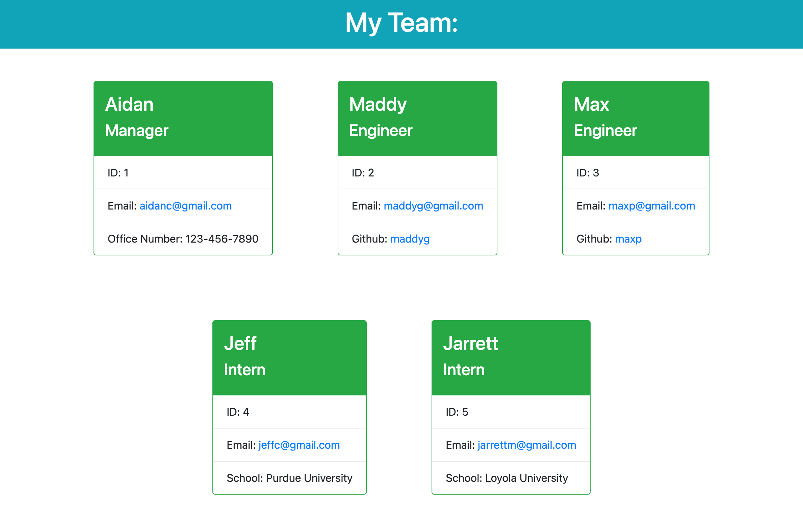

# hw10-team-profile-generator

## Table of Contents:

-   [Description](./README.md#description)
-   [Installation](./README.md#installation)
-   [Usage](./README.md#usage)
-   [Contributing](./README.md#contributing)
-   [Tests](./README.md#tests)
-   [Screenshot](./README.md#screenshot)
-   [Links to Application](./README.md#links-to-application)
-   [Questions](./README.md#questions)

## Description

This is an application that accepts information about employees on a team and then generates an HTML page that displays a summary of the information about each person. The user is prompted to choose an employee role. If Manager is chosen, the user is prompted to provide name, ID, email, and office number. If Engineer is chosen, the user is prompted to provide name, ID, email, and GitHub username. If Intern is chose, the user is prompted to provide name, ID, email, and school. The displayed emails will automaticall open the default mail application and create an email draft with the clicked email in the "TO" section. The GitHub usernames for the Engineer role are links to the respective GitHub user. When the user chooses to finish, or the maximium number of employees is reached, the application generates the HTML file and saves it in the "dist" folder.

## Installation

If you wish to use this application, you will need to access my GitHub account (RedComet6) and copy the code.

## Usage

To use this application, obtain the code from my GitHub account (RedComet6), and run "node index.js" from the command line terminal.

## Contributing

If you wish to contribute to my content, please contact me at asunshine99@gmail.com.

## Tests

To test this application, use the test files by typing "npm test" in the command line terminal.

## Screenshot

## Links to Application

-   Here is the demo video on Google Drive: [https://drive.google.com/file/d/129D7NfPRfFvrmcgBh1HNZsL_cVAHM9tz/view?usp=sharing](https://drive.google.com/file/d/129D7NfPRfFvrmcgBh1HNZsL_cVAHM9tz/view?usp=sharing)
-   Here is the repo: [https://github.com/RedComet6/hw10-team-profile-generator](https://github.com/RedComet6/hw10-team-profile-generator)
-   Here is the pages: [https://redcomet6.github.io/hw10-team-profile-generator/](https://redcomet6.github.io/hw10-team-profile-generator/)

## Questions

If you have any questions, you may contact:

#### Aidan Chamberlain

Email: asunshine99@gmail.com  
Github Profile: [https://www.github.com/RedComet6](https://www.github.com/RedComet6)
